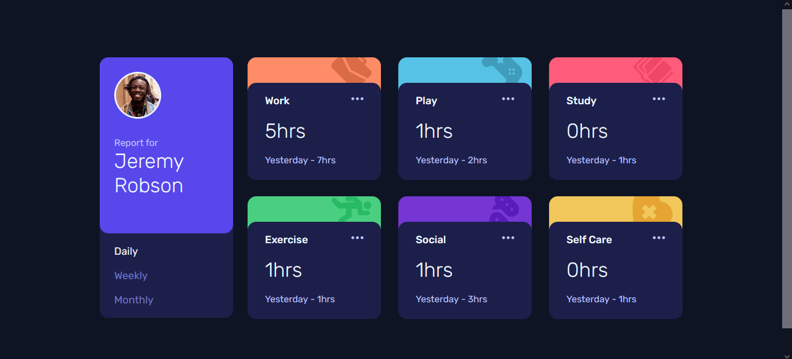
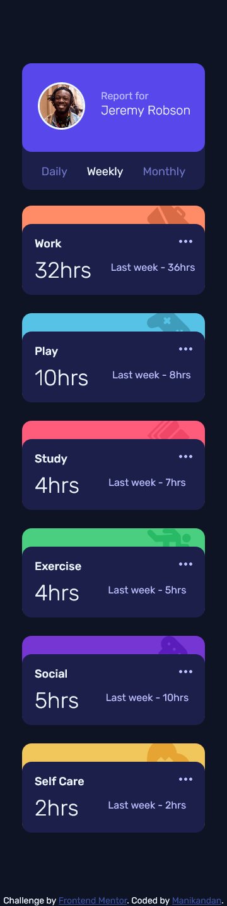

# Frontend Mentor - Time tracking dashboard solution

This is a solution to the [Time tracking dashboard challenge on Frontend Mentor](https://www.frontendmentor.io/challenges/time-tracking-dashboard-UIQ7167Jw). Frontend Mentor challenges help you improve your coding skills by building realistic projects.

## Table of contents

-   [Overview](#overview)
    -   [The challenge](#the-challenge)
    -   [Screenshot](#screenshot)
    -   [Links](#links)
-   [My process](#my-process)
    -   [Built with](#built-with)
    -   [What I learned](#what-i-learned)
    -   [Continued development](#continued-development)
    -   [Useful resources](#useful-resources)
-   [Author](#author)
-   [Acknowledgments](#acknowledgments)

**Note: Delete this note and update the table of contents based on what sections you keep.**

## Overview

### The challenge

Users should be able to:

-   View the optimal layout for the site depending on their device's screen size
-   See hover states for all interactive elements on the page
-   Switch between viewing Daily, Weekly, and Monthly stats

### Screenshot




### Links

-   Solution URL: [Add solution URL here](https://github.com/mani-cmd/time-tracking-dashboard)
-   Live Site URL: [Add live site URL here](https://time-tracking-dashboard-git-master-mani-cmd.vercel.app/)

## My process

### Built with

-   Flexbox
-   CSS Grid
-   [Vite](https://vitejs.dev/) - JS library
-   [SCSS](https://sass-lang.com/) - For styles

### What I learned

I had fun building this project and I learned and used css grid for the first time it was a awesome experience.

```css
@media only screen and (max-width: 375px) {
    :root {
        --margin-left: 2.5rem;
        --margin-top: 3rem;

        --card-gutter: 3rem;
    }
}
```

```js

options.forEach(option => {
    option.addEventListener('click', e => {
        // Removing the Active class from the options
        let parentList = document.querySelector('#option-list');
        parentList.querySelector('.active').classList.remove('active');

        // Changing the text in the Card through this function
        theDataHandler(e.target.innerText.toLowerCase());

        // adding active class list to the event target
        e.target.classList.add('active');
    });
});

};
```

### Continued development

I Want to focus more on the javascript and responsive design and make use of a frame work like vue or react.

### Useful resources

-   [WebDevSimplified](https://www.youtube.com/c/WebDevSimplified) - This man helped me for Griding with CSS.
-   [Stack Over Flow](https://stackoverflow.com/) - This is an amazing article which helped me finally understand how to query DOM elements from the parent. (I linked to main page because i forgot the URL sorry 😞)

## Author

-   Frontend Mentor - [@mani-cmd](https://www.frontendmentor.io/profile/mani-cmd)

## Acknowledgments

I followed the CSS grid tutorial from WebDevSimpilifed and StackOverFlow.
